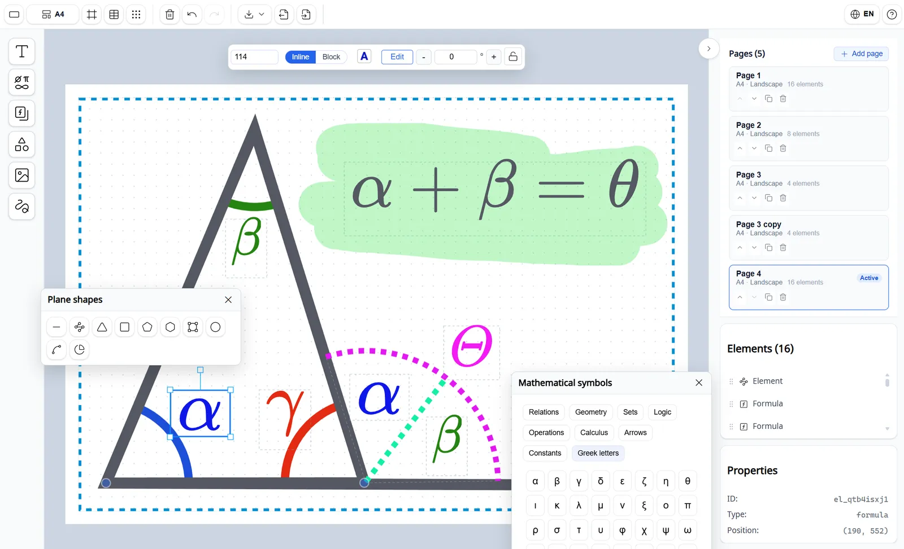

# Math on Canvas — Marketing & Auth Shell

Online math diagram and formula editor for teachers. This repository contains the **Next.js marketing site and authentication layer** that wraps the canvas editor.

🌐 **Live:** [math-on-canvas.com](https://math-on-canvas.com)



---

## What this repo is

The product consists of two parts:

| Part | Tech | Repo |
|------|------|------|
| **This repo** — landing page, i18n routing, auth proxy | Next.js 16 (App Router) | `math-on-canvas` |
| Editor — canvas, shapes, LaTeX formulas, PDF export | Vite + React SPA | separate repo |

Next.js proxies `/editor/*` to the Vite app via `rewrites` in `next.config.ts`, so the two apps are served as a single origin.

---

## Tech stack

- **Next.js 16** — App Router, Server Components, `proxy.ts` for edge routing
- **TypeScript** — strict mode throughout
- **React 19** with React Compiler (`babel-plugin-react-compiler`)
- **jose** — JWT verification against a remote JWKS endpoint (RS256)
- **i18n** — 4 languages (EN / RU / ES / DE), server-side static imports, no client i18n library

---

## Architecture highlights

### Language routing
`src/proxy.ts` runs at the edge on every request:
- `GET /` → redirects to `/{lang}` based on `lang` cookie or `Accept-Language` header
- `GET /{lang}` → sets `x-lang` response header, read by `RootLayout` for `<html lang>`
- Valid token → decodes JWT, forwards `x-user-id`, `x-user-role`, `x-user-ent` headers to Server Components

### Server-side rendering
`src/app/[lang]/page.tsx` is a Server Component — it reads user identity from headers (set by the proxy) and renders the fully-hydrated landing page. Googlebot receives complete HTML with H1, text content and structured data.

### Auth
JWT access tokens are verified server-side using `jose` + remote JWKS. The token never leaves the server — only derived user metadata is forwarded as headers.

### SEO
- `generateMetadata` per locale: canonical URL, hreflang for all 4 languages, locale-specific Open Graph tags
- Schema.org `WebApplication` JSON-LD in `<head>`
- `src/app/sitemap.ts` generates `/sitemap.xml` with all language variants and `lastModified`
- All images use `next/image` with explicit `width`/`height` and `priority` on LCP

---

## Project structure

```
src/
├── app/
│   ├── [lang]/             # SSR landing page (en/ru/es/de)
│   │   ├── layout.tsx      # generateMetadata: canonical, hreflang, OG
│   │   └── page.tsx        # Server Component: auth check + LandingPage
│   ├── (marketing)/
│   │   └── landing/        # LandingPage + widgets (Carousel, SignIn, LanguageSwitch)
│   ├── layout.tsx           # RootLayout: html lang, Schema.org JSON-LD
│   └── sitemap.ts           # Dynamic sitemap with i18n alternates
├── lib/
│   ├── auth/               # JWT verification (jose), user context from headers
│   ├── i18n/               # Language constants + locale JSON files
│   └── site.ts             # BASE_URL constant
└── proxy.ts                # Edge proxy: lang redirect, x-lang header, token decode
```

---

## Local setup

**Prerequisites:** Node.js 20+, a running auth service (or mock JWT)

```bash
npm install
```

Create `.env.local`:
```env
AUTH_JWKS_URL=http://localhost:3001/auth/.well-known/jwks.json
AUTH_ISSUER=https://local.math-on-canvas.dev
AUTH_AUDIENCE=math-on-canvas-local
AUTH_LOGIN_URL=http://localhost:3001/auth/login
AUTH_LOGOUT_URL=http://localhost:3001/auth/logout
AUTH_API_URL=http://localhost:3001
NEXT_PUBLIC_AUTH_LOGIN_URL=http://localhost:3001/auth/login
NEXT_PUBLIC_AUTH_LOGOUT_URL=http://localhost:3001/auth/logout
```

```bash
npm run dev       # http://localhost:3000
npm run build
npm run lint
```

The editor SPA is proxied from `EDITOR_URL` (default: `http://localhost:5173`). Without it running, `/editor` will return a 502 — the landing page works independently.

---

## License

MIT